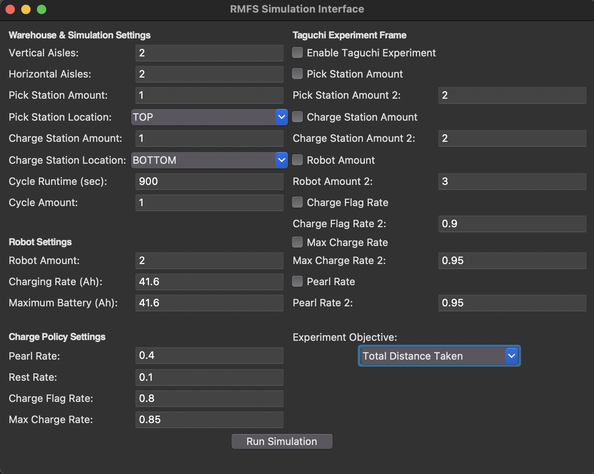
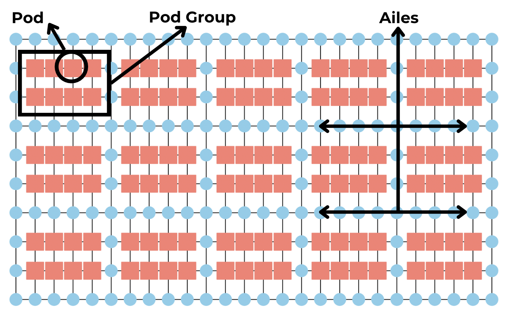
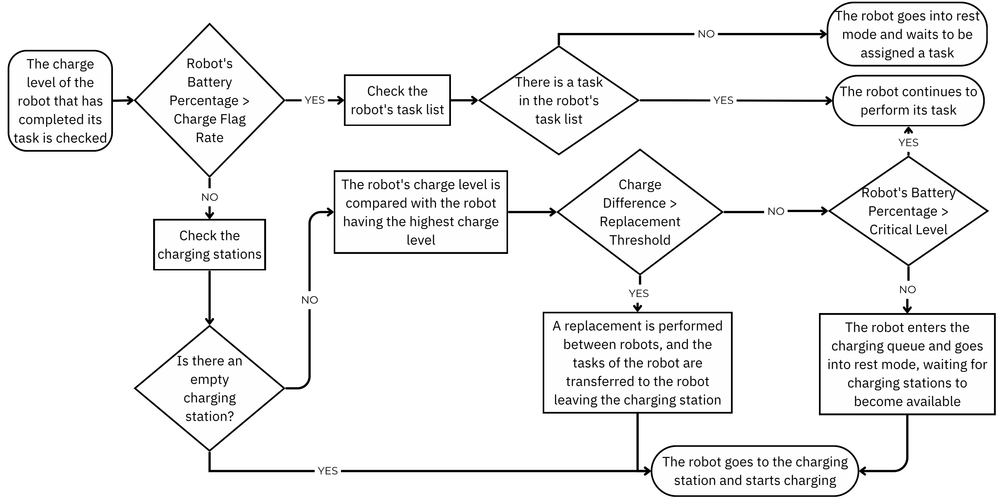

# RMFS Simulation

This is a Robotic Mobile Fulfillment System (RMFS) simulation written to try different strategies for assignment and routing problems in a robotic warehouse. The project is a part of [IE497](https://catalog.metu.edu.tr/course.php?course_code=5680497) - [IE498](https://catalog.metu.edu.tr/course.php?course_code=5680498) Systems Design course of [METU Industrial Engineering](https://ie.metu.edu.tr) department.

The simulation is working with the described features below. You can run the simulation using the guide below. For further features, you can open an issue, pull request or contact me.

**Language:** Python

**Libraries:** pandas, numpy, simpy, networkx, gurobi, google or tools, pydoe3, tkinter

# Step by Step Guide

<strong>Step 1:</strong> Run the `interface.py` file.

**Warehouse & Simulation Settings:**

1. Horizontal & Vertical Ailes:

Number of inner ailes. Shelves/pods are created as a group of 2x4=8.

e.g. When there are 2 horizontal and 2 vertical ailes, there are 4 corridors in each direction and a layout of 10x16 is created.

2. Station Amounts and Locations:

Pick stations and charge stations are created. Station amount of one type cannot exceed the number of ailes in that direction.
Total station to be placed on a side cannot exceed the number of ailes intersecting with that side.

3. Cycle Amount and Runtime:

The tasks and routes are determined in cycles. Cycle runtime is in seconds, so if a cycle runtime is determined as 900 seconds and the number of cycles is 4, total simulation time is an hour.

**Robot Settings:**

All robots in the simulation are of the same type.

1. Robot Amount: Number of robots in the simulation.

2. Charging Rate (Ah): Charging rate of the robots' battery.

3. Maximum Battery (Ah): Maximum charge capacity of the robots' battery.

**Charge Policy Settings:**

1. Pearl Rate: If the charge difference between charge-seeking and charging robot is above the pearl rate (replacement threshold), charging robot gives its place in charging station to the charge-seeker.

2. Rest Rate: The percentage charge level of the robot to leave the charge station.

3. Charge Flag Rate: The percentage charge level of the robot to seek for an empty charge station.

4. Max Charge Rate: The percentage charge level of the robot to leave the charge station.

**Taguchi Experiment Frame:**

1. Enable Taguchi Experiment: In order to conduct experimentation, in other words, run the simulation once and get different configured simulation results, you need to check this box.

2. Pick Station, Charge Station Amount: In order to try different amounts of stations, check the boxes and enter the second amount.

3. Charge Flag Rate, Max Charge Rate, Pearl Rate: You can input secondary values for these features by checking their boxes.

4. Experiment Objective: Currently does not affect the output. Regardless of your choice, experiments result for all metrics.

If you're all set, you can click "Run Simulation" and you'll receive an output Excel.
Current experiments file are filled with experiments from our senior year, you can clear those files before starting experimentations.

When you choose what you want to experiment, an experiment matrix is created using [PyDOE3](https://pydoe3.readthedocs.io/en/latest/). You can see the experiment matrix in the output Excel.

**Experiment Outputs:**

For each robot, time-dependent:
- Task
- Distance traveled
- Charge level
- Number of completed tasks
- Number of remaining tasks

Additionally, throughout the simulation:
- Number of products collected by each station
- Number of times each robot went to charge
- Number of times each robot moved to charge